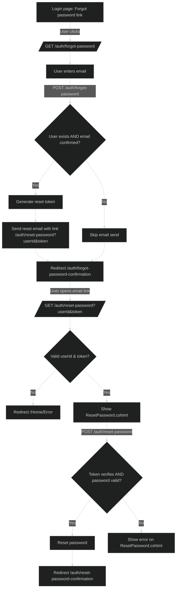
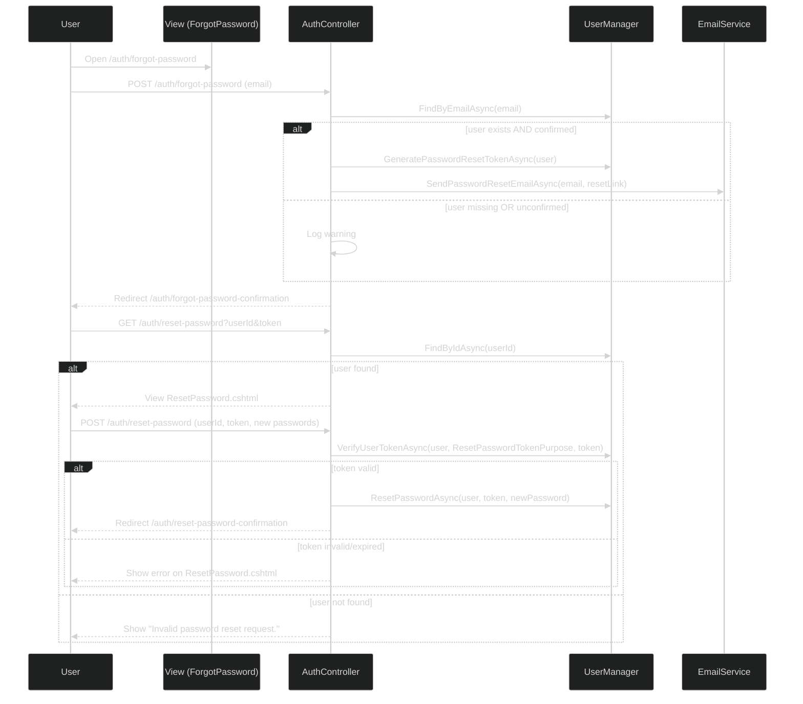
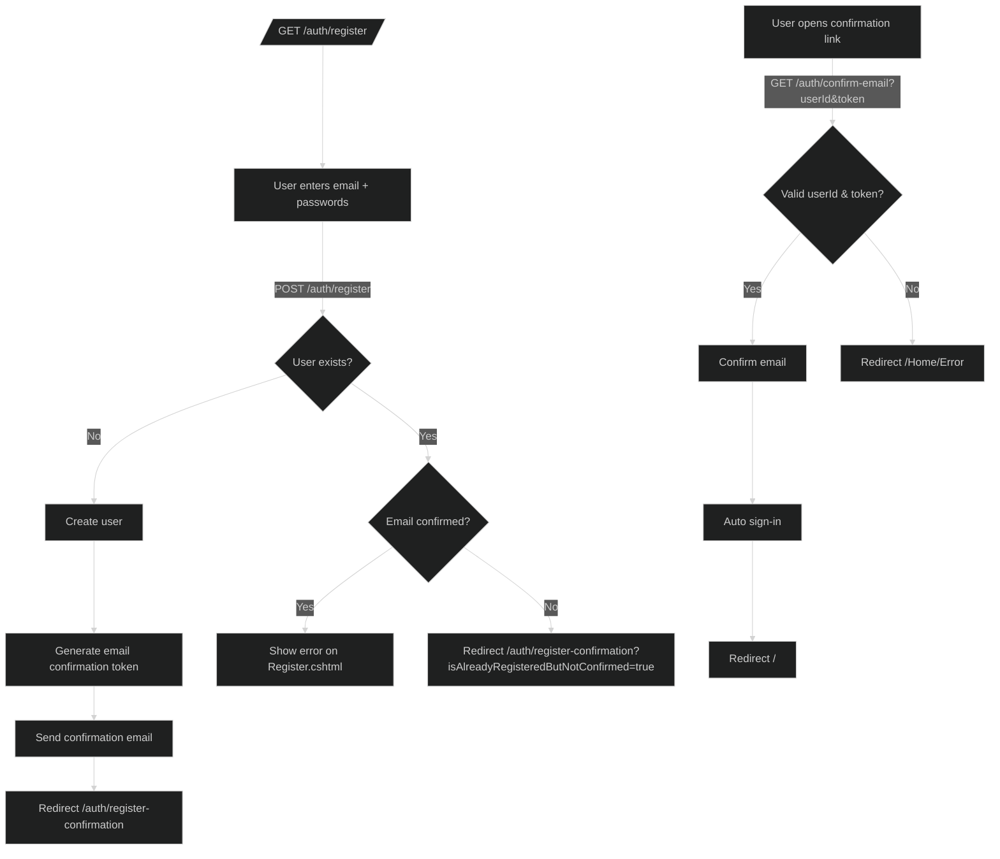

## CareerPilotAi Authentication Flows (End-User and Developer Overview)

This document describes all authentication flows implemented in the application with exact routes, view locations, expected behaviors, redirections, and user-visible messages. It also includes Mermaid diagrams (dark theme) for complex flows.

- Routes live in `AuthController` (route prefix: `/auth`).
- Views live in `Views/Auth/*` (Razor `.cshtml`).
- After successful login, users are redirected to `JobApplication/Index` (`/job-applications`) unless a safe local `ReturnUrl` is provided.
- Token lifetimes/policies use default ASP.NET Identity providers unless customized (not overridden in `Infrastructure/Identity/IdentityExtensions.cs`).

---

### Table of Contents

- Login
- Registration
- Email Confirmation
- Resend Confirmation
- Logout
- Access Denied
- Forgot Password
- Reset Password
- Post-login redirect target: Job Applications

---

### Login

- Purpose: Authenticate existing, confirmed users.
- GET route: `/auth/login` → View: `Views/Auth/Login.cshtml`
- POST route: `/auth/login`
- Inputs: Email, Password, Remember Me; optional `returnUrl` query string.
- In-view navigation:
  - “Forgot password?” → `/auth/forgot-password`
  - “Sign up” → `/auth/register`
- Outcomes (from controller logic):
  - Success → Redirect to local `ReturnUrl` if `Url.IsLocalUrl(returnUrl)`; otherwise → `/job-applications`.
  - Unconfirmed email (valid password) → Redirect to `/auth/register-confirmation?isAlreadyRegisteredButNotConfirmed=true`.
  - Non-existent user or invalid credentials → Stay on view with message: "Login failed. Please check your email and password."
  - General validation errors → Stay on view and display validation messages.

---

### Registration

- Purpose: Create a new account; email confirmation required before login.
- GET route: `/auth/register` → View: `Views/Auth/Register.cshtml`
- POST route: `/auth/register`
- In-view navigation:
  - “Log in” → `/auth/login`
- Outcomes:
  - Success (new user) → Email confirmation link sent; redirect → `/auth/register-confirmation`.
  - Email already exists and confirmed → Stay on view with: "An account with this email already exists. Please log in or reset your password."
  - Email already exists but not confirmed → Redirect → `/auth/register-confirmation?isAlreadyRegisteredButNotConfirmed=true`.
  - Email send failure after user created → Stay on view with: "Sign up failed, something happened on our end. Please contact support."

---

### Email Confirmation

- Purpose: Activate a new account.
- GET route: `/auth/confirm-email?userId={id}&token={token}`
- Success: Confirms email, auto-signs in, redirect → `Home/Index` (`/`).
- Failure cases: Missing parameters, invalid user, or invalid token → Redirect → `Home/Error`.

Register Confirmation View
- GET route: `/auth/register-confirmation` → View: `Views/Auth/RegisterConfirmation.cshtml`
- Optional query: `isAlreadyRegisteredButNotConfirmed=true` shows info banner.
- In-view navigation:
  - “Resend confirmation email” → `/auth/resend-confirmation`
  - “Return to Login” → `/auth/login`

---

### Resend Confirmation

- Purpose: Send a new confirmation email to unconfirmed accounts.
- GET route: `/auth/resend-confirmation` → View: `Views/Auth/ResendConfirmation.cshtml`
- POST route: `/auth/resend-confirmation`
- In-view navigation: “Back to Login” → `/auth/login`
- Outcomes:
  - Unconfirmed existing user → Email resent → Redirect → `/auth/register-confirmation`.
  - Non-existent user → Redirect → `/auth/register-confirmation` (no enumeration).
  - Already confirmed → Redirect → `/auth/login?isAlreadyRegisteredAndConfirmed=true` (message shown on login view).
  - Email send failure → Stay on view with: "Failed to send confirmation email. Please try again later or contact support."

---

### Logout

- Purpose: Sign the current user out.
- POST route: `/auth/logout`
- After sign-out: Redirect → `/auth/logout` (GET) → View: `Views/Auth/LogoutConfirmation.cshtml`
- Logout Confirmation View navigation:
  - “Log Back In” → `/auth/login`
  - “Go to Homepage” → `/`
  - Helpful links: `/job-applications`, `/job-applications/entry-job-details`

---

### Access Denied

- Purpose: Inform the user they lack permission.
- GET route: `/auth/access-denied` → View: `Views/Auth/AccessDenied.cshtml`
- In-view navigation:
  - “Return to Home Page” → `/`
  - “Go to Sign In” → `/auth/login`

---

### Forgot Password

- Purpose: Initiate a password reset via email.
- GET route: `/auth/forgot-password` → View: `Views/Auth/ForgotPassword.cshtml`
- POST route: `/auth/forgot-password`
- In-view navigation: “Back to Login” → `/auth/login`
- Outcomes:
  - Confirmed user → Reset email sent → Redirect → `/auth/forgot-password-confirmation`.
  - Non-existent or unconfirmed user → Redirect → `/auth/forgot-password-confirmation` (no enumeration).
  - Email send failure → Still Redirect → `/auth/forgot-password-confirmation`.

Forgot Password Confirmation View
- GET route: `/auth/forgot-password-confirmation` → View: `Views/Auth/ForgotPasswordConfirmation.cshtml`
- In-view navigation: “Return to Login” → `/auth/login`

---

### Reset Password

- Purpose: Set a new password using the email link.
- GET route: `/auth/reset-password?userId={id}&token={token}` → View: `Views/Auth/ResetPassword.cshtml`
- POST route: `/auth/reset-password`
- In-view navigation: “Back to Login” → `/auth/login`
- Outcomes:
  - Valid token and matching new passwords → Redirect → `/auth/reset-password-confirmation`.
  - Invalid/expired token → Stay on view with: "Password reset link may have expired or is invalid. Please try again or request a new one."
  - Non-existent user → Stay on view with: "Invalid password reset request."

Reset Password Confirmation View
- GET route: `/auth/reset-password-confirmation` → View: `Views/Auth/ResetPasswordConfirmation.cshtml`
- In-view navigation: “Continue to Login” → `/auth/login`

---

### Post-login Redirect Target: Job Applications

- Target after successful login when no local `ReturnUrl` provided: `JobApplication/Index`.
- Route: `/job-applications` (controller: `JobApplicationController`, `[Authorize]`).
- Not documented here in detail; mentioned as the redirect destination.

---

## Diagrams (Mermaid, dark theme)

Note: Diagram theme set to dark.

Reset Password – End-to-End (Flowchart)

Reset Password – Sequence

Registration + Email Confirmation – Flowchart

---

## Exact Paths and View Files

- Login: GET `/auth/login`, POST `/auth/login` → `Views/Auth/Login.cshtml`
- Register: GET `/auth/register`, POST `/auth/register` → `Views/Auth/Register.cshtml`
- Register Confirmation: GET `/auth/register-confirmation` → `Views/Auth/RegisterConfirmation.cshtml`
- Confirm Email: GET `/auth/confirm-email?userId&token`
- Resend Confirmation: GET/POST `/auth/resend-confirmation` → `Views/Auth/ResendConfirmation.cshtml`
- Logout: POST `/auth/logout`; Logout Confirmation: GET `/auth/logout` → `Views/Auth/LogoutConfirmation.cshtml`
- Access Denied: GET `/auth/access-denied` → `Views/Auth/AccessDenied.cshtml`
- Forgot Password: GET/POST `/auth/forgot-password` → `Views/Auth/ForgotPassword.cshtml`
- Forgot Password Confirmation: GET `/auth/forgot-password-confirmation` → `Views/Auth/ForgotPasswordConfirmation.cshtml`
- Reset Password: GET/POST `/auth/reset-password` → `Views/Auth/ResetPassword.cshtml`
- Reset Password Confirmation: GET `/auth/reset-password-confirmation` → `Views/Auth/ResetPasswordConfirmation.cshtml`
- Post-login redirect default: `JobApplication/Index` → GET `/job-applications` (view)

---

## Notes on ReturnUrl and Tokens

- ReturnUrl: Login redirects to `returnUrl` only if `Url.IsLocalUrl(returnUrl)`; otherwise to `/job-applications`.
- Token policies: Using ASP.NET Identity default token providers. Password policy per `IdentityExtensions`: minimum length 8, require upper/lower/digit/non-alphanumeric; unique emails required; email confirmation required to sign in.

